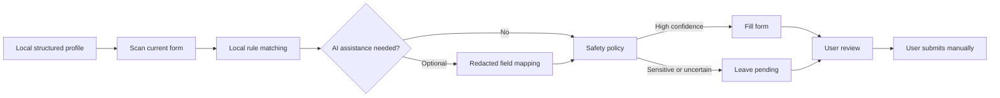

<p align="center">
  
</p>

<h1 align="center">ResumeBridge</h1>

<p align="center">
  One local profile, reused across recruiting systems.
</p>

<p align="center">
  
  
  
  <a href="LICENSE"></a>
</p>

<p align="center">
  <a href="README.md">中文</a> | English
</p>

ResumeBridge is a Chrome and Edge extension for assisted job-application form filling. It keeps one structured profile in local extension storage, matches that profile to different recruiting forms with local rules and optional AI assistance, fills only high-confidence fields, and leaves sensitive or uncertain decisions for the user.

> [!IMPORTANT]
> ResumeBridge is a filling assistant, not an application bot. It does not upload files, bypass CAPTCHAs, or click final submit controls. Every run is user initiated and every result requires review.

Version **0.1.0 is a developer preview** intended for local evaluation, testing, and continued development. It is not yet distributed through a browser extension store.

## Current development status

| Area | Implemented status |
| --- | --- |
| Fill performance | High-confidence fields are resolved locally first; only ambiguous fields reach AI, with at most one compact mapping request per run |
| Complex date controls | Supports split start/end year-month groups and option lookup in common scrollable custom dropdowns |
| Repeated projects | Recognizes project-experience and research-project sections, fills in local profile order, and invokes bounded add actions only inside verified project sections |
| Application tracking | Extracts user-confirmed company and role candidates, then stores application time, status, notes, filters, editing, and CSV export locally |
| Verification | The current suite contains 39 automated tests; Edge extension smoke coverage includes conservative filling, date dropdowns, two project records, tracking, and privacy boundaries |

Fixtures prevent regressions in known behavior; they are not a permanent compatibility guarantee for every recruiting site. Review every field before submission.

## Why ResumeBridge

Recruiting systems represent the same resume data with different labels, controls, and page structures. Applicants repeatedly enter education, employment, project, and preference data while having little control over how automation handles sensitive information.

ResumeBridge turns that repetition into a reviewable local workflow:



## Capabilities

| Area | Current implementation |
| --- | --- |
| Reusable profile | Personal details, job preferences, education, employment, projects, certificates, family information, and custom sections |
| Form controls | Text inputs, textareas, native selects, dates, radio buttons, checkboxes, split year/month ranges, and selected React/Vue controls |
| Recruiting heuristics | Rules for Beisen, Moka, Feishu Jobs, HotJob, Zhaopin, Liepin, Nowcoder, and common UI libraries |
| Project experience | Recognizes project-experience, research-project, and related field variants; bounded inline repeaters can be expanded and filled in profile order |
| Local-first matching | Works without AI and falls back to local matching when AI is unavailable |
| Optional AI mapping | Runs local matching first, then sends at most one bounded compact request for unresolved or low-confidence fields without sending local profile values |
| Safety controls | Preserves existing values by default and excludes sensitive, declaration, upload, and submit controls |
| Human review | Separates filled and pending fields; final submission always remains manual |
| Application tracking | Detects company and role from the active recruiting page, then stores user-confirmed time, status, and notes with filtering, editing, and CSV export |
| Migration | Imports legacy OpenJobAutofill backups and exports the ResumeBridge backup format |

Recruiting pages change frequently. A listed heuristic is not a permanent compatibility guarantee. Unrecognized controls should remain pending instead of being filled aggressively.

## Safety and privacy

### Conservative defaults

| Situation | Default behavior | Configurable |
| --- | --- | --- |
| A page field already has a value | Preserve it | Yes |
| Identity, family, emergency contact, health, and similar sensitive fields | Leave for review | Yes |
| Background checks, declarations, conflict and compliance questions | Leave for review | Yes |
| File uploads and final submission controls | Never automate | No |

### Local data boundary

- Profile and API settings are stored in `chrome.storage.local`, not browser sync storage.
- Application history is also local-only. Source URLs are stored without queries or fragments, reducing retention of common query tokens.
- Recruiting-page content scripts can suggest company and role values but cannot read, change, or delete application history.
- API keys, headers, and request templates are available only to trusted extension pages, not recruiting-page content scripts.
- The in-page quick-copy panel uses a closed shadow root to reduce direct inspection of profile text that has not been written to the form.
- Page access is granted through `activeTab` and `scripting` only after the user invokes the extension.
- Local storage is not yet a passphrase-encrypted vault. Do not keep unnecessary identity or family data on a shared computer.

### AI data boundary

AI is disabled until configured. Each **Start filling** run makes at most one mapping request; if local rules resolve every field with high confidence, AI is skipped. The request is limited to fields that still need assistance and primarily contains:

- the page origin, without URL paths, queries, or fragments;
- field labels, placeholders, control kinds, and section metadata;
- profile schema paths and labels such as `education[0].school`;
- redaction markers in place of existing page values.

It should not contain local profile values such as names, phone numbers, email addresses, document numbers, school or employer names, or experience text. Users choose their own AI provider; only configure a service whose data handling terms you trust.

## Install

The current version loads directly in developer mode and has no build step.

```powershell
git clone https://github.com/xiaocheng223/ResumeBridge.git
cd ResumeBridge
```

1. Open `chrome://extensions/` or `edge://extensions/`.
2. Enable Developer mode.
3. Select **Load unpacked**.
4. Choose the cloned `ResumeBridge` directory.
5. Pin the ResumeBridge extension.

Import [sample-profile.json](sample-profile.json) from Settings to try the workflow with entirely fictional data.

## Use

1. Open Settings from the extension popup.
2. Enter and save a local profile, then review the conservative fill policy.
3. Open an application or online-resume page.
4. Select **Start filling** in ResumeBridge.
5. Review filled fields and the pending-field list.
6. Complete uploads, sensitive questions, CAPTCHAs, and final submission manually.
7. Reopen ResumeBridge, verify the company, role, time, and status under **Application tracking**, then save the record.
8. Open the tracker to update statuses and notes or export CSV.

## Compatibility notes

- Browser: Manifest V3 for current Chrome and Edge releases.
- Controls: native controls have the broadest coverage, with support for common custom start/end year-month dropdown groups and inline project repeaters; modal project editors, shadow DOM, cascading addresses, rich editors, and unsupported virtual lists may require another run or manual handling.
- Multi-step forms: invoke ResumeBridge again after navigating to the next step.
- Platform policies: ResumeBridge does not bypass CAPTCHAs, anti-automation controls, or recruiting-platform rules.
- AI endpoints: common OpenAI-style `/chat/completions` APIs are supported, but provider-specific response formats may require adaptation.

## Development and verification

Node.js 20 or newer is required. Runtime code has no third-party dependencies; tests use the built-in Node.js test runner.

```powershell
npm run check   # Syntax-check extension scripts
npm test        # Run unit tests
npm run verify  # Run checks and tests
```

Current tests cover conservative fill policy, extension-message privilege boundaries, AI request redaction, the single bounded AI mapping path, split year/month dropdown filling, project-section and add-action recognition, repeated project ordering, legacy backup compatibility, local fallback behavior, job-page detection, and application-history persistence. Browser smoke-test notes are available in [docs/qa/resume-bridge-foundation.md](docs/qa/resume-bridge-foundation.md).

## Repository layout

```text
ResumeBridge/
├─ manifest.json              # Chrome extension manifest
├─ src/
│  ├─ background.js           # Settings, AI calls, and message boundary
│  ├─ content.js              # Form scanning, matching, filling, and feedback
│  ├─ options.*               # Profile and policy settings
│  ├─ popup.*                 # Extension popup
│  ├─ tracker.*               # Application tracking table
│  ├─ job-tracker.js          # Tracking model and page-signal resolver
│  ├─ date-utils.js           # Date parsing, projection, and numeric option matching
│  ├─ project-utils.js        # Project-section, field, and bounded add-action recognition
│  ├─ safety-policy.js        # Conservative fill policy
│  ├─ message-policy.js       # Runtime message authorization
│  └─ ai-privacy.js           # AI request redaction helpers
├─ tests/                     # Unit tests and form fixture
├─ scripts/                   # Logo and browser QA helpers
├─ docs/                      # Implementation and QA records
└─ sample-profile.json        # Entirely fictional sample profile
```

## Current limitations

- Site-specific rules need wider regression coverage against current recruiting pages.
- Company and role detection depends on structured data and heuristic page signals, so users must verify records before saving.
- Local profiles do not yet support passphrase encryption, multiple variants, or job-specific switching.
- Corrected mappings are not yet learned and reused per site.
- Open-ended questions do not yet have a separate, review-before-send AI drafting flow.
- There is no signed extension-store package or automatic update channel.

## Roadmap

1. Add an ATS adapter catalog, anonymized page fixtures, and continuous regression tests.
2. Learn corrected mappings locally and reuse them per domain.
3. Support multiple profile variants and job-specific fields.
4. Add editable, review-before-send AI drafts for open-ended questions.
5. Add encrypted exports and an optional local profile vault.
6. Complete permission and privacy review for Chrome and Edge store distribution.

The roadmap describes direction, not committed versions or delivery dates.

## Contributing

Reproducible issues, adapter fixtures, and focused improvements are welcome. Never post a real resume, cookies, API keys, full private recruiting pages, or other personal data in a public issue. Use the fictional values from [sample-profile.json](sample-profile.json) when creating a minimal reproduction.

## License

ResumeBridge is released under the [MIT License](LICENSE).
