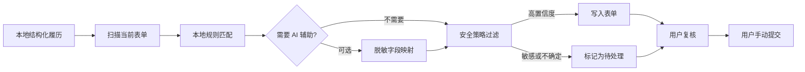

<p align="center">
  
</p>

<h1 align="center">履历桥 ResumeBridge</h1>

<p align="center">
  一份本地履历，辅助填写不同招聘系统。
</p>

<p align="center">
  
  
  
  <a href="LICENSE"></a>
</p>

<p align="center">
  中文 | <a href="README.en.md">English</a>
</p>

ResumeBridge 是一个面向求职网申场景的 Chrome / Edge 浏览器扩展。用户只需在本机维护一份结构化履历，即可在不同招聘网站上复用；扩展通过本地规则和可选 AI 理解表单字段，只填写高置信度内容，并把敏感、声明类或不确定字段留给用户确认。

> [!IMPORTANT]
> ResumeBridge 是填写辅助工具，不是自动投递工具。它不会上传附件、绕过验证码或点击最终提交。每次填写都由用户主动触发，结果也必须由用户复核。

当前版本为 **0.1.0 开发预览版**，适合本地试用、参与测试和继续开发，尚未发布到浏览器扩展商店。

## 当前开发进展

| 方向 | 已实现状态 |
| --- | --- |
| 填写性能 | 本地规则先完成高置信度匹配；仅把疑难字段交给 AI，每次填写最多发起一次精简映射请求 |
| 复杂日期控件 | 支持开始年、开始月、结束年、结束月等分拆日期组合，并可在常见滚动式自定义下拉中查找选项 |
| 多条项目经历 | 识别项目经历、项目经验、科研项目等分区，按本地项目顺序填写；只在已确认的项目区有限触发“添加项目” |
| 投递追踪 | 从当前招聘页提取待确认的公司和职位，记录投递时间、状态、备注，并支持筛选、编辑和 CSV 导出 |
| 质量验证 | 当前自动化套件包含 39 项测试；Edge 扩展冒烟测试覆盖谨慎填写、日期下拉、两条项目经历、投递追踪与隐私边界 |

自动化样例用于防止已知行为回归，不代表对所有招聘网站永久兼容。真实页面仍应在提交前逐项复核。

## 为什么做这个项目

不同招聘系统对同一份履历使用不同字段、控件和页面结构。求职者不得不重复录入教育、经历、项目和求职意向，也很难在效率与信息安全之间取得平衡。

ResumeBridge 的目标不是代替用户作出承诺，而是把重复录入变成一条可检查的本地工作流：



## 核心能力

| 能力 | 当前实现 |
| --- | --- |
| 一份履历复用 | 本地维护基本信息、求职意向、教育、工作、项目、证书、家庭信息和自定义栏目 |
| 表单识别 | 支持文本框、文本域、原生选择框、日期、单选、多选、分拆年/月日期区间及部分 React / Vue 自定义控件 |
| 招聘系统适配 | 已包含北森、Moka、飞书招聘、HotJob、智联、猎聘、牛客及常见 UI 组件的启发式规则 |
| 项目经历填写 | 识别项目经历、项目经验、科研项目等常见分区与字段别名；内联项目列表可按本地资料条数有限新增并按顺序填写 |
| 本地优先匹配 | 未配置 AI 时可完全使用本地规则；AI 不可用时自动回退到本地匹配 |
| 可选 AI 映射 | 先完成本地匹配，仅对未识别或低置信度字段发起一次有数量上限的精简请求，不直接接收本机履历资料值 |
| 风险控制 | 默认不覆盖已有内容，不自动填写敏感字段和声明，不处理上传与提交控件 |
| 人工复核 | 已填写与待处理字段分别标记，最终提交始终由用户完成 |
| 投递追踪 | 从当前招聘页识别公司与职位，经用户确认后保存投递时间、状态和备注，并提供筛选、编辑与 CSV 导出 |
| 数据迁移 | 可导入旧版 OpenJobAutofill 备份，并导出 ResumeBridge 格式的本地备份 |

招聘网站会持续调整页面结构，因此“已有适配规则”不等于对相应网站永久兼容。遇到未识别控件时，扩展会尽量保留为待处理项，而不是强行填写。

## 安全与隐私

### 默认填写策略

| 场景 | 默认行为 | 是否可配置 |
| --- | --- | --- |
| 网页字段已有内容 | 不覆盖 | 可开启覆盖 |
| 证件、家庭、紧急联系人、健康等敏感字段 | 留给人工确认 | 可开启填写 |
| 背景调查、诚信声明、亲属回避、合规问答 | 留给人工确认 | 可开启填写 |
| 文件上传、申请按钮、最终提交 | 永不自动操作 | 不可开启 |

### 本地数据边界

- 履历和 API 配置保存在当前浏览器扩展的 `chrome.storage.local`，不使用浏览器同步存储。
- 投递记录同样只保存在 `chrome.storage.local`；来源 URL 会移除查询参数和片段，降低保留常见查询令牌的风险。
- 招聘页面只能提供待确认的公司与职位候选，不能读取、修改或删除投递历史。
- API Key、Headers 和请求模板只向扩展自身的受信页面开放，招聘网站内容脚本不能读取这些配置。
- 页面内快速复制面板使用 closed Shadow DOM，减少招聘网站脚本直接读取面板中未写入表单内容的机会。
- 扩展只在用户主动点击后，通过 `activeTab` 与 `scripting` 权限访问当前页面。
- 当前本地存储不是口令加密保险箱。请勿在共享电脑中保存不必要的身份证、家庭成员等资料。

### AI 数据边界

AI 功能默认关闭。配置后，每次“开始填写”最多发起一次字段映射请求；如果本地规则已能高置信度处理全部字段，则不会调用 AI。请求只包含仍需辅助判断的有限字段，主要包括：

- 页面来源域名，不包含 URL 路径、查询参数或片段；
- 字段标签、占位符、控件类型、分组等页面元数据；
- 履历字段的结构路径与标签，例如 `education[0].school`；
- 已有网页字段值会被省略或替换为脱敏标记。

请求不应包含姓名、电话、邮箱、证件号、学校名称、公司名称或经历正文等本机履历资料值。自定义 AI 服务由用户自行选择，其数据处理条款不受本项目控制，请只配置可信服务。

## 安装

当前版本通过开发者模式加载，无需构建。

```powershell
git clone https://github.com/xiaocheng223/ResumeBridge.git
cd ResumeBridge
```

1. 打开 `chrome://extensions/` 或 `edge://extensions/`。
2. 开启“开发者模式”。
3. 点击“加载已解压的扩展程序”。
4. 选择克隆后的 `ResumeBridge` 目录。
5. 固定“履历桥 ResumeBridge”扩展图标。

可以在设置页导入 [sample-profile.json](sample-profile.json) 体验流程，其中全部内容均为虚构数据。

## 使用

1. 点击扩展图标，在弹窗中打开“设置”。
2. 填写并保存本地履历，按需要调整谨慎填写策略。
3. 打开招聘网站的申请页或在线简历页。
4. 点击扩展中的“开始填写”。
5. 核对已填写字段和橙色待处理字段。
6. 手动完成附件、敏感问答、验证码和最终提交。
7. 再次打开扩展，核对“投递追踪”中的公司、职位、时间和状态，然后点击“记录本次投递”。
8. 点击“查看记录”管理投递状态、备注，或导出 CSV。

> [!TIP]
> 首次在某个网站使用时，建议保留全部谨慎策略，只用虚构或低敏感度数据验证字段映射是否正确。

## 兼容性说明

- 浏览器：基于 Manifest V3，面向新版 Chrome 与 Edge。
- 页面控件：原生表单控件覆盖较好，并支持常见的开始/结束年、月自定义下拉组合与内联项目经历列表；弹窗式新增项目、Shadow DOM、级联地址、复杂富文本和未适配的虚拟列表仍可能需要手动处理或再次运行填写。
- 多步骤表单：切换到下一页后需要再次点击“开始填写”。
- 平台规则：本项目不绕过验证码、反自动化机制或招聘平台限制。
- AI 接口：兼容常见 OpenAI 风格的 `/chat/completions` 接口；不同服务的响应格式仍可能需要适配。

## 开发与验证

需要 Node.js 20 或更高版本。项目没有运行时第三方依赖，测试使用 Node.js 内置测试运行器。

```powershell
npm run check   # 检查扩展脚本语法
npm test        # 运行单元测试
npm run verify  # 依次执行语法检查和测试
```

当前测试重点覆盖：

- 谨慎填写策略与不可自动操作的控件；
- 内容脚本与扩展设置之间的权限边界；
- AI 请求中的 URL 和字段值脱敏；
- 单次、限量的 AI 映射路径与分拆年/月日期下拉填写；
- 项目分区识别、字段别名、多条项目按序映射及“添加项目”按钮的上下文约束；
- OpenJobAutofill 备份兼容；
- AI 未配置或失败时的本地回退行为。
- 招聘页信息识别、投递记录去重和投递历史权限边界。

浏览器端冒烟测试说明见 [docs/qa/resume-bridge-foundation.md](docs/qa/resume-bridge-foundation.md)。

## 项目结构

```text
ResumeBridge/
├─ manifest.json              # Chrome 扩展清单
├─ src/
│  ├─ background.js           # 配置、AI 调用与消息边界
│  ├─ content.js              # 表单扫描、匹配、填写与页面反馈
│  ├─ options.*               # 履历和策略设置页
│  ├─ popup.*                 # 扩展弹窗
│  ├─ tracker.*               # 投递追踪表格页
│  ├─ job-tracker.js          # 投递记录模型与页面信号解析
│  ├─ date-utils.js           # 日期拆分、投影与数值选项匹配
│  ├─ project-utils.js        # 项目分区、字段与安全新增动作识别
│  ├─ safety-policy.js        # 谨慎填写策略
│  ├─ message-policy.js       # 扩展消息权限策略
│  └─ ai-privacy.js           # AI 请求脱敏工具
├─ tests/                     # Node.js 单元测试与表单样例
├─ scripts/                   # Logo 与浏览器 QA 辅助脚本
├─ docs/                      # 实施计划和质量验证记录
└─ sample-profile.json        # 纯虚构示例履历
```

## 当前限制

- 网站专用规则仍需通过更多真实页面持续回归验证。
- 公司和职位识别依赖招聘页结构化数据与启发式页面信号，保存前仍需用户核对。
- 本地资料暂未提供口令加密、多份履历版本和职位级资料切换。
- 用户纠正后的字段映射尚不能按网站自动学习和复用。
- 开放题暂不提供独立的 AI 草稿审阅流程。
- 当前没有浏览器商店签名包或自动更新通道。

## 路线图

1. 建立 ATS 适配器目录、匿名化页面样例和持续回归测试。
2. 在本地记录用户纠正后的字段映射，并按域名复用。
3. 支持多份履历版本与职位定制字段。
4. 为开放题增加发送前预览、可编辑的 AI 草稿流程。
5. 增加加密导出和可选的本地资料保险箱。
6. 完成 Chrome / Edge 扩展商店发布所需的权限与隐私审查。

路线图代表开发方向，不构成版本或交付日期承诺。

## 参与项目

欢迎通过 Issue 提交可复现的问题、字段适配样例和改进建议。公开 Issue 中请勿粘贴真实履历、Cookie、API Key、完整招聘页面源码或其他个人信息；建议使用 [sample-profile.json](sample-profile.json) 中的虚构数据构造最小复现。

## 许可

ResumeBridge 使用 [MIT License](LICENSE) 发布。
